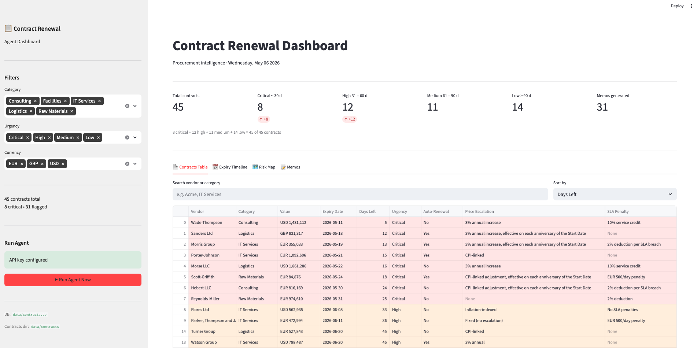
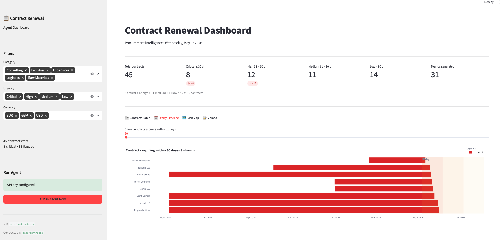
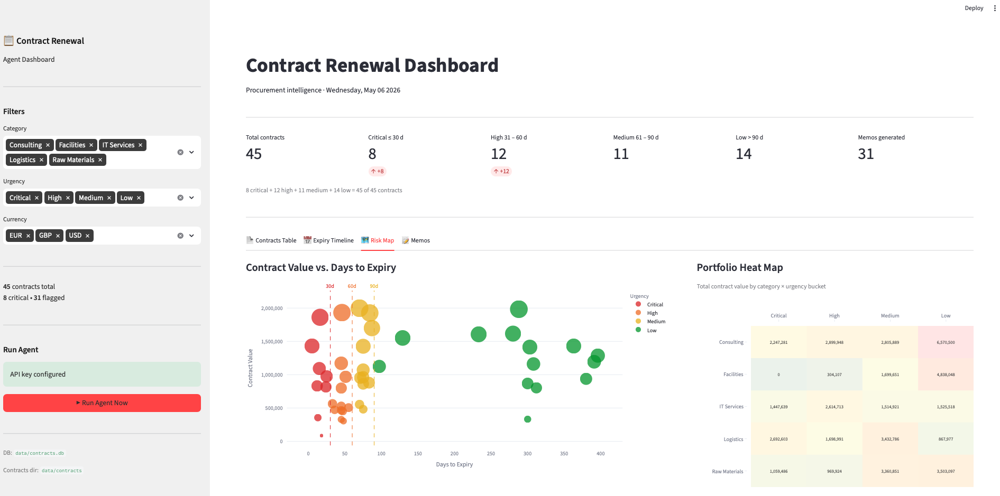
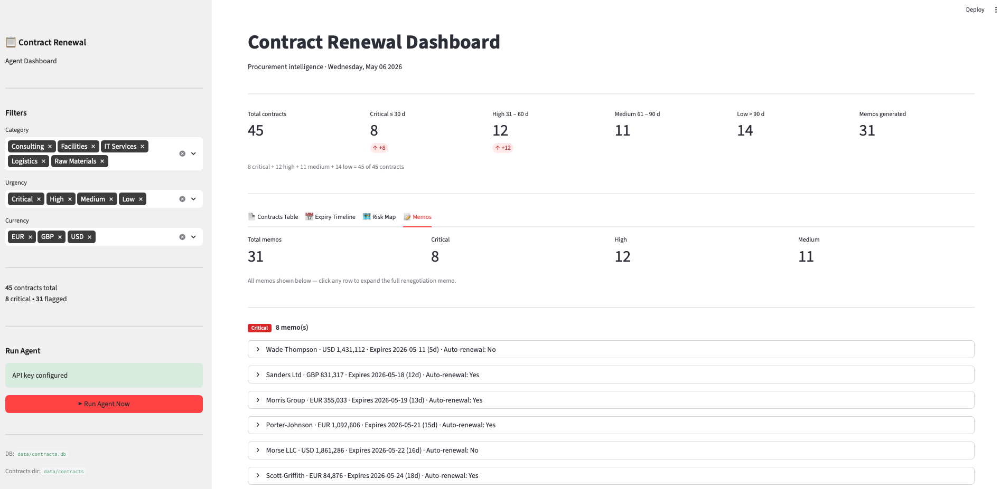

# Procurement Contract Intelligence & Renewal Agent

> **Procurement Contract Intelligence & Renewal Agent** — an autonomous agent that reads procurement contracts, extracts key terms, monitors renewal deadlines, benchmarks market pricing, and drafts renegotiation memos — without any manual intervention.

---

## The Problem

Procurement contracts pile up across shared drives and ERPs. Teams routinely:

- **Miss renewal deadlines** — auto-renewals trigger at unfavourable terms
- **Fail to enforce price escalation clauses** — overpaying year after year
- **Have no easy way to compare terms across vendors** — each contract is a different PDF with different clause language

This is not a data problem. The contracts exist. The problem is that nobody has the bandwidth to read 200 PDFs every quarter and cross-reference them against market rates.

This agent does exactly that — autonomously, daily, at scale.

---

## What the Agent Does

The agent runs on a daily schedule (or on demand) and executes a full agentic loop:

1. **Ingests** all PDF contracts from a folder via the Filesystem MCP
2. **Extracts** key terms using Claude — expiry dates, pricing clauses, SLA penalties, auto-renewal conditions — even when clause language varies between contracts
3. **Stores** structured data in SQLite via the Database MCP (persistent, grows over time)
4. **Checks** for upcoming renewals at 90 / 60 / 30 day thresholds
5. **Benchmarks** current market pricing for each contract category via the Web Search MCP
6. **Drafts** a renegotiation recommendation memo per contract — including a suggested negotiation position
7. **Alerts** the procurement team via email with the memo attached

A **human-in-the-loop checkpoint** gates the alert step: urgent renewals (≤ 30 days) trigger automatic alerts; others are flagged for review.

---

## Architecture

```
┌─────────────────────────────────────────────────────────────┐
│                    LangGraph Agent Loop                     │
│                                                             │
│  ingest → extract → check_renewals → benchmark              │
│                                          ↓                  │
│                                    draft_memos              │
│                                          ↓                  │
│                              [HITL gate: urgent?]           │
│                               ↙              ↘              │
│                           alert           draft_only        │
└─────────────────────────────────────────────────────────────┘
         ↕              ↕              ↕              ↕
   Filesystem     Database MCP    Search MCP     Email MCP
      MCP          (SQLite)       (SerpAPI)     (notifications)
   (PDF reads)   (contract store) (benchmarks)
```

---

## MCP Servers Used

| MCP Server | Role |
|---|---|
| `filesystem_mcp.py` | Reads PDF contracts from the `data/contracts/` folder |
| `database_mcp.py` | Stores and queries extracted contract data in SQLite |
| `search_mcp.py` | Benchmarks current market pricing via web search |
| `email_mcp.py` | Sends renewal alert emails with memo summaries |

---

## Tech Stack

| Layer | Technology |
|---|---|
| **Orchestration** | [LangGraph](https://github.com/langchain-ai/langgraph) — stateful, multi-step graph with conditional edges |
| **LLM** | Claude (`claude-sonnet-4-6`) via Anthropic SDK — PDF reading + clause analysis |
| **Protocol** | MCP (Model Context Protocol) — standardised tool connections |
| **Database** | SQLite via `aiosqlite` — auto-created on first run |
| **PDF generation** | `fpdf2` — for synthetic test contracts |
| **Synthetic data** | `faker` — realistic vendor names, dates, values |
| **Notifications** | `smtplib` (email) |
| **Testing** | `pytest` + `pytest-asyncio` |

---

## Project Structure

```
contract-renewal-agent/
│
├── main.py                          # Entry point — run once or on schedule
├── config.py                        # Centralised config (env vars, thresholds)
├── requirements.txt
├── .env.example                     # Copy to .env and fill in your keys
├── README.md
│
├── agent/                           # LangGraph brain
│   ├── graph.py                     # Graph definition — nodes + edges + conditions
│   ├── nodes.py                     # One async function per agent step
│   ├── state.py                     # TypedDict: shared state across all nodes
│   ├── prompts.py                   # Claude system prompts + alert templates
│   └── checkpoints.py               # Human-in-the-loop routing logic
│
├── mcp_servers/                     # MCP server wrappers
│   ├── base_mcp.py                  # Shared base class
│   ├── filesystem_mcp.py            # Read PDFs from folder
│   ├── database_mcp.py              # SQLite contract store (upsert + query)
│   ├── search_mcp.py                # Web search for market benchmarks
│   ├── email_mcp.py                 # SMTP email alerts (dry-run if unconfigured)
│
├── data/
│   ├── contracts/                   # Drop your PDFs here (or run generate script)
│   └── contracts.db                 # SQLite — auto-created on first run
│
├── synthetic_data/                  # Test data generation
│   ├── generate_contracts.py        # Creates 30 realistic PDF contracts (fpdf2)
│   ├── seed_database.py             # Pre-seeds SQLite with faker records
│   └── templates/                   # 3–5 varied clause structures
│
├── outputs/
│   ├── memos/                       # Renegotiation memos (.md, one per contract)
│   └── renewal_alerts/              # Alert records
│
└── tests/
    ├── test_extraction.py           # Unit tests for the extraction node
    └── test_graph.py                # Graph compilation + node coverage tests
```

---

## Quickstart

### 1. Clone and install

```bash
git clone https://github.com/Artsplendr/AgenticAI-Procurement-Contract-Renewal-Agent-with-MCP-LangGraph.git
cd contract-renewal-agent

python -m venv .venv
source .venv/bin/activate          # Windows: .venv\Scripts\activate
pip install -r requirements.txt
```

### 2. Configure environment

```bash
cp .env.example .env
```

Open `.env` and fill in:

```env
ANTHROPIC_API_KEY=sk-ant-...       # Required — powers extraction + memos
SERP_API_KEY=...                   # Optional — real web search (mock used if absent)
SMTP_HOST=smtp.gmail.com           # Optional — real emails (dry-run if absent)
SMTP_USER=you@example.com
SMTP_PASS=...
```

> **No keys needed for a dry run.** Without SMTP config, alerts print to console. Without SerpAPI, mock benchmark data is used. Only `ANTHROPIC_API_KEY` is required for the full extraction + memo pipeline.

### 3. Generate synthetic test data

```bash
python synthetic_data/generate_contracts.py   # Creates 30 PDF contracts in data/contracts/
python synthetic_data/seed_database.py        # Optional: pre-seeds SQLite
```

The generator deliberately distributes contract expiry dates across all alert thresholds (< 30 days, 31–60, 61–90, 90+) so every part of the agent gets exercised on first run.

### 4. Run the agent

```bash
# Run once (great for testing)
python main.py --mode once

# Run on daily schedule at 08:00
python main.py --mode schedule
```

### 5. Check the outputs

```
outputs/memos/           ← one .md file per flagged contract
outputs/renewal_alerts/  ← alert logs
data/contracts.db        ← open with DB Browser for SQLite to inspect extracted data
```

---

## Running Tests

```bash
pytest tests/ -v
```

Tests cover:
- `test_extraction.py` — mocks Claude API, verifies the extraction node parses responses correctly and handles errors gracefully
- `test_graph.py` — verifies the LangGraph graph compiles and all expected nodes are present

---

## How the Agentic Loop Works (In Plain English)

Think of the agent as a procurement analyst who comes into the office every morning at 8am, does the following, and then sends you a summary:

1. **Opens the contracts folder** and reads every PDF (Filesystem MCP)
2. **Reads each contract carefully** and fills in a structured form — vendor, value, expiry date, price clauses, SLA terms — using Claude to handle the varied language (some contracts say "Termination Date", others "Contract Expiry")
3. **Saves the form to a database** so nothing is ever lost between runs (Database MCP)
4. **Checks the calendar** — which contracts are expiring in the next 30, 60, or 90 days?
5. **Looks up current market rates** for each contract category online (Web Search MCP)
6. **Writes a one-page memo** for each flagged contract: here's what we're paying, here's what the market says, here's what I recommend we negotiate
7. **Sends you an email** if anything is expiring in the next 30 days, with the memo attached (Email MCP)

The only human decision is: do you act on the memo?

---

## What a Generated Memo Looks Like

```
CONTRACT RENEWAL RECOMMENDATION — Acme Corp (IT Services)
==========================================================

Current contract:
  Value: EUR 380,000/year | Expiry: 2026-06-15 (28 days)
  Auto-renewal: YES — activates if no action taken by June 1
  Price escalation clause: 3% annual increase
  SLA penalty: 2% deduction per breach

Market context:
  IT managed services — EUR 220–310/day rate card (2026 benchmark)
  Current contract implies EUR 290/day equivalent — within market range
  but escalation clause will push to EUR 299/day next year (+3%)

Recommended position:
  1. Do not let auto-renewal trigger — initiate renegotiation
  2. Target: cap price escalation at 1.5% (from 3%) for next 2 years
  3. Strengthen SLA penalty to 5% per breach (from 2%)
  4. Request volume discount given 3-year relationship

Next steps:
  - Contact vendor by May 30 to signal renegotiation intent
  - Request updated rate card for 2026/27
  - Escalate to CPO if vendor is unwilling to revise escalation clause
```

---

## Roadmap / Extension Ideas

- [ ] **PostgreSQL support** — swap SQLite for Postgres for multi-user environments
- [ ] **Streamlit dashboard** — visual overview of all contracts, expiry timeline, risk heatmap
- [ ] **Multi-language contracts** — Claude handles English, German, French natively
- [ ] **ERP integration** — MCP server for SAP Ariba or Coupa to pull contracts automatically
- [ ] **Clause risk scoring** — flag unfavourable clauses (one-sided liability, auto-renewal traps)
- [ ] **A2A orchestration** — delegate to a specialist sub-agent for legal clause review

---

## Key Concepts for Interviewers / Reviewers

**Why LangGraph?** Because the workflow is not a straight line. The `check_renewals` node may find zero contracts, in which case the graph exits early. The `alert` node only fires for urgent renewals. LangGraph's conditional edges model this cleanly — and its checkpointing means the state is never lost between runs.

**Why MCP?** Each external system (filesystem, database, web, email) is encapsulated in its own MCP server. The agent never talks to these systems directly — it calls tools. This means you can swap SQLite for PostgreSQL, or SerpAPI for Tavily, without touching the agent code.

**Why synthetic data?** No real supplier data, no GDPR concerns, no NDA issues. The synthetic generator creates realistic edge cases (auto-renewal traps, missing clauses, expired contracts) that make the demo more impressive than clean real data would.

---

## Credits & References

- [Anthropic MCP Documentation](https://modelcontextprotocol.io/)
- [LangGraph Documentation](https://langchain-ai.github.io/langgraph/)
- [Art of Procurement — State of AI in Procurement 2026](https://artofprocurement.com/blog/state-of-ai-in-procurement)
- [McKinsey — Redefining procurement performance in the era of agentic AI](https://www.mckinsey.com/capabilities/operations/our-insights/redefining-procurement-performance-in-the-era-of-agentic-ai)

---
## Use Case — Dashboard

The Streamlit dashboard (`dashboard.py`) surfaces the agent's output across four tabs, giving the procurement team a live view of contract risk without opening a single PDF.

The **Contracts Table** tab lists every contract in the portfolio with its vendor, category, value, expiry date, days remaining, urgency tier, auto-renewal flag, price-escalation clause, and SLA penalty — filterable by category, urgency, and currency.



The **Expiry Timeline** tab renders a Gantt-style bar chart showing when each contract expires within a configurable look-ahead window, colour-coded by urgency so critical deadlines are immediately visible.



The **Risk Map** tab combines a contract-value vs. days-to-expiry bubble chart (bubble size scales with contract value) with a portfolio heat map that breaks total exposure down by spend category and urgency bucket.



The **Memos** tab lists all AI-drafted renegotiation memos grouped by urgency tier (Critical → High → Medium), each collapsible row expanding to reveal the full negotiation recommendation generated by Claude.




